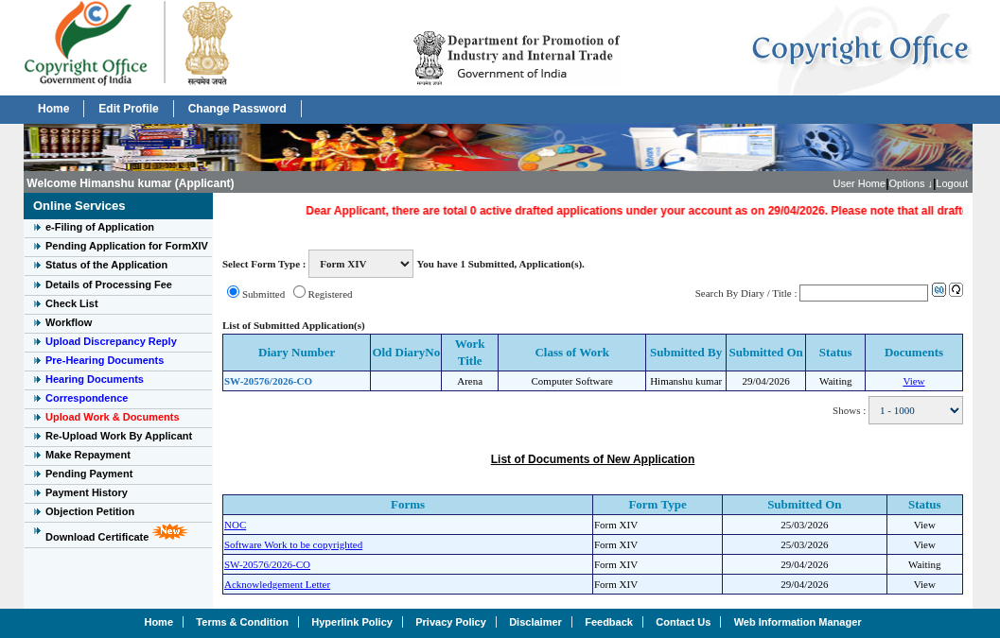

# ARENA (Android Game)

## 📌 Project Details
- **Project Title:** ARENA  
- **Type:** Copyright  

## 👨‍💻 Team Information

### Team Lead
- **Name:** Himanshu Kumar  
- **Roll No:** 2210991661  

### Team Member
- **Name:** Chirag Bhatia  
- **Roll No:** 2210990238  

## 📄 Application Details
- **Diary Number:** SW-20576/2026-CO   
- **Submitted By:** Himanshu Kumar  
- **Submitted On:** 29/04/2026  

## ⏳ Current Status
- **Application Status:** Complete
- **Copyright Status:** Waiting  

## 📱 Published On Play Store
- **App Link:** https://play.google.com/store/apps/details?id=com.himanshyou.arena




# ARENA

A minimalist, high-performance survival game built with React Native and Expo.

## Project Vision
ARENA is designed to be "always on" and extremely efficient, using minimal CPU resources by leveraging native animations and lightweight game logic.

## Technical Details
- **Framework**: React Native / Expo
- **Performance**: 
    - Native driver animations for smooth, low-CPU rendering.
    - Minimalist state management (refs for high-frequency game logic).
    - Lightweight collision detection.
- **Copyright**: © 2026 ARENA. All Rights Reserved. Public copyright for future buildability.

## Build Instructions
1.  **Install Dependencies**:
    ```bash
    npm install
    ```
2.  **Run Development Server**:
    ```bash
    npx expo start
    ```
3.  **Build for Android (APK)**:
    ```bash
    npx expo run:android --variant release
    ```
    *Note: Ensure you have the Android SDK and appropriate build tools configured.*

## Copyright and License
This software is provided "as-is" for the purpose of buildable game development. I hereby declare the copyright for "ARENA" to be maintained for future development and publishing.
